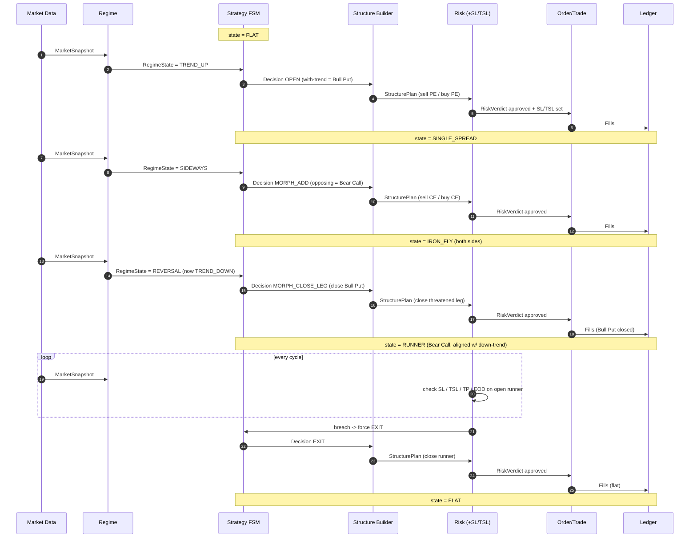

# ATOM — Functional Design

**Companion to PROJECT_DOCUMENT.md (charter) and TECHNICAL_DESIGN.md (build).**
Draft v0.4 · The *what & why*: trading behaviour, independent of how it's built.

This document owns the strategy lifecycle and the functional (domain-capability) view.
Buildable modules, contracts, and the requirements traceability matrix are in
TECHNICAL_DESIGN.md. Requirement IDs (FR/RR/PR) are defined in PROJECT_DOCUMENT.md §9.

---

## 1. The Adaptive Theta Lifecycle

ATOM is a **state machine** over the live structure. It enters with-trend to collect
directional theta, morphs into a range structure when trend stalls, and sheds the
threatened leg when trend reverses — keeping the now-aligned spread as a trailing
runner.

### 1.1 State Diagram

```
            ┌──────────────────────────────────────────────────────┐
            │                       FLAT                            │
            │                  (no position)                        │
            └───────────────┬──────────────────────────────────────┘
                            │  Regime = TREND (up/down)
                            ▼
            ┌──────────────────────────────────────────────────────┐
            │                  SINGLE_SPREAD                        │
            │  Uptrend   → Bull Put Spread   (sell PE / buy PE)     │
            │  Downtrend → Bear Call Spread  (sell CE / buy CE)     │
            │  → with-trend credit, theta + mild directional        │
            └──────┬─────────────────────────────┬──────────────────┘
                   │ Regime → SIDEWAYS            │ SL/TSL/TP/EOD
                   ▼                              ▼
            ┌──────────────────────────┐      ┌───────────┐
            │        IRON_FLY          │      │   FLAT    │
            │  add opposing credit     │      └───────────┘
            │  spread → range theta    │
            │  both sides              │
            └──────┬───────────────────┘
                   │ Regime → TREND reverses (opposite side)
                   ▼
            ┌──────────────────────────────────────────────────────┐
            │                     RUNNER                            │
            │  Close the original (now-threatened) spread.          │
            │  Keep the spread aligned with new trend.              │
            │  Manage with SL / trailing-SL until exit.             │
            └───────────────┬──────────────────────────────────────┘
                            │ SL/TSL/TP/EOD
                            ▼
                          FLAT
```

### 1.2 Transition Rules

| From          | Trigger                          | Action                                                            | To            |
|---------------|----------------------------------|-------------------------------------------------------------------|---------------|
| FLAT          | Trend confirmed (up/down)        | Open with-trend credit spread (Bull Put if up, Bear Call if down) | SINGLE_SPREAD |
| SINGLE_SPREAD | Regime turns sideways            | Add opposing credit spread → structure becomes iron fly/condor    | IRON_FLY      |
| SINGLE_SPREAD | SL / TSL / TP / EOD              | Close spread                                                      | FLAT          |
| IRON_FLY      | Trend resumes in opposite dir    | Close the threatened (original) spread; retain aligned spread     | RUNNER        |
| IRON_FLY      | SL / TSL / TP / EOD              | Close both spreads                                                | FLAT          |
| RUNNER        | SL / TSL / TP / EOD              | Close remaining spread                                            | FLAT          |

Notes:
- **With-trend credit spread** = spread whose max-profit zone sits with the trend, so
  trend + theta both pay (Bull Put when up, Bear Call when down).
- The **opposing spread** added on the sideways turn is the mirror leg that completes
  the iron fly — premium from both sides while the market ranges.
- On reversal, the leg now in the path of price is the **threatened** leg and is
  closed; the surviving leg is already aligned with the new trend and becomes the runner.

### 1.3 Sequence Diagram — one full lifecycle

A representative session walking FLAT → SINGLE_SPREAD → IRON_FLY → RUNNER → FLAT.
Participants are functional roles (their technical modules are in TECHNICAL_DESIGN.md).



### 1.4 Open Strategy Questions (for review)
- **Regime inputs:** which indicators/timeframes confirm trend vs. sideways vs.
  reversal. Placeholder: multi-TF trend + range filter.
- **Strike/wing rule:** delta-band vs. fixed-distance vs. premium-target. Placeholder:
  delta-band.
- **Post-exit:** does the runner's exit re-arm a fresh structure same session, or stay
  flat until the next clean signal?

---

## 2. Functional Risk View

Risk behaviour, stated functionally (parameters in PROJECT_DOCUMENT.md §5, enforcement
in TECHNICAL_DESIGN.md Risk Engine):

- One live structure per index; deploy capped at ₹2L.
- A hard 10% drawdown floor ends the structure/day.
- Every state — including RUNNER — carries an SL and a trailing-SL.
- Up to 2 re-entries per session; everything squared off at EOD.
- The risk gate is deterministic and cannot be overridden by any advisory/LLM layer.

---

## 3. Functional Modules (domain capabilities)

The *what/why* groupings. Each maps to requirement IDs (PROJECT_DOCUMENT.md §9) and to
one or more technical modules (TECHNICAL_DESIGN.md §7 RTM).

| Functional module        | Purpose (what/why)                                        | Requirements           |
|--------------------------|-----------------------------------------------------------|------------------------|
| FM-Regime                | Read the market, name the regime                          | FR-1                   |
| FM-Lifecycle             | The adaptive theta state machine (entry→morph→runner→exit)| FR-2, FR-3, FR-4, FR-6 |
| FM-StructureSelection    | Choose weekly strikes/wings for each structure            | FR-5                   |
| FM-RiskControl           | Sizing, deploy cap, DD floor, daily-loss, re-entry, gate  | RR-1, RR-2, RR-4, RR-6 |
| FM-StopManagement        | SL / TSL / TP setting and trailing                        | RR-3                   |
| FM-SessionLifecycle      | Entry windows, cadence, EOD square-off                    | RR-5, PR-8             |
| FM-Connectivity          | Broker auth + session                                     | PR-1                   |
| FM-InstrumentResolution  | Strike ladder, lots, tradingsymbol format                 | PR-2                   |
| FM-MarketData            | Spot, chain, IV, multi-TF OHLC acquisition                | PR-3                   |
| FM-Execution             | Place/modify/cancel orders, capture fills                 | PR-4                   |
| FM-Bookkeeping           | Position + P&L truth store                                | PR-5                   |
| FM-Audit                 | Decision/transition trace, explainability                 | PR-6                   |
| FM-Configuration         | Central params                                            | PR-7                   |
