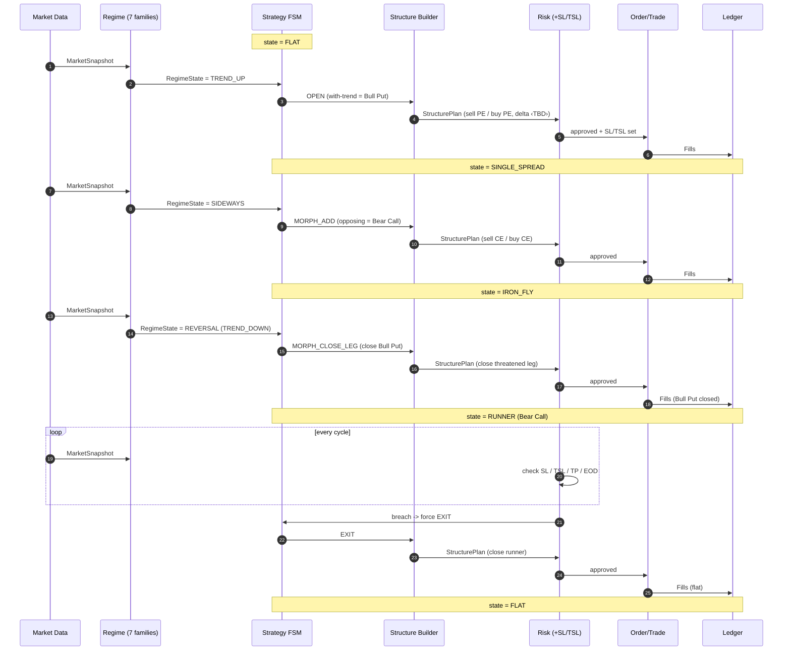

# ATOM — Functional Design

**Companion to PROJECT_DOCUMENT.md (charter) and TECHNICAL_DESIGN.md (build).**
Draft v0.5 · The trading/business spec — *what a good options trader does*, in trader
language: regime reading, greeks, candlesticks, structure choice. **No code here.**

> **Scope note:** this document fixes the **flow and the logic**, not the numbers.
> Every threshold (delta levels, ADX cutoffs, theta targets, family weights, …) is an
> **open parameter** marked `‹TBD›`, to be set in a later deep-grilling pass. We are
> agreeing on *how the trader thinks*, not yet on the exact values.

Requirement IDs (FR/RR/PR) are in PROJECT_DOCUMENT.md §9. Buildable modules and tests
are in TECHNICAL_DESIGN.md.

---

## 1. The Adaptive Theta Lifecycle

ATOM enters with-trend to collect directional theta, morphs into a range structure when
trend stalls, and sheds the threatened leg on reversal — keeping the aligned spread as a
trailing runner.

### 1.1 State Diagram

```
            ┌──────────────────────────────────────────────────────┐
            │                       FLAT                            │
            │                  (no position)                        │
            └───────────────┬──────────────────────────────────────┘
                            │  Regime = TREND (up/down)
                            ▼
            ┌──────────────────────────────────────────────────────┐
            │                  SINGLE_SPREAD                        │
            │  Uptrend   → Bull Put Spread   (sell PE / buy PE)     │
            │  Downtrend → Bear Call Spread  (sell CE / buy CE)     │
            │  → with-trend credit, theta + mild directional        │
            └──────┬─────────────────────────────┬──────────────────┘
                   │ Regime → SIDEWAYS            │ SL/TSL/TP/EOD
                   ▼                              ▼
            ┌──────────────────────────┐      ┌───────────┐
            │        IRON_FLY          │      │   FLAT    │
            │  add opposing credit     │      └───────────┘
            │  spread → range theta    │
            └──────┬───────────────────┘
                   │ Regime → TREND reverses (opposite side)
                   ▼
            ┌──────────────────────────────────────────────────────┐
            │                     RUNNER                            │
            │  Close threatened (original) spread; keep aligned     │
            │  spread; manage with SL / trailing-SL until exit.     │
            └───────────────┬──────────────────────────────────────┘
                            │ SL/TSL/TP/EOD
                            ▼
                          FLAT
```

### 1.2 Transition Rules

| From          | Trigger                          | Action                                                            | To            |
|---------------|----------------------------------|-------------------------------------------------------------------|---------------|
| FLAT          | Trend confirmed (up/down)        | Open with-trend credit spread (Bull Put if up, Bear Call if down) | SINGLE_SPREAD |
| SINGLE_SPREAD | Regime turns sideways            | Add opposing credit spread → iron fly/condor                      | IRON_FLY      |
| SINGLE_SPREAD | SL / TSL / TP / EOD              | Close spread                                                      | FLAT          |
| IRON_FLY      | Trend resumes in opposite dir    | Close threatened (original) spread; retain aligned spread         | RUNNER        |
| IRON_FLY      | SL / TSL / TP / EOD              | Close both spreads                                                | FLAT          |
| RUNNER        | SL / TSL / TP / EOD              | Close remaining spread                                            | FLAT          |

### 1.3 Sequence Diagram — one full lifecycle



---

## 2. Signal Model — Seven Indicator Families

Regime is **not** read from any single indicator. ATOM reads **seven indicator
families** and forms a consensus, so no one signal over-dominates and directional bias
is suppressed. Each family contributes a vote (direction + strength); the regime label
and confidence come from the ensemble.

| # | Family                       | Reads                                  | Example members (exact set ‹TBD›)        |
|---|------------------------------|----------------------------------------|------------------------------------------|
| 1 | **Trend**                    | direction & strength of the move       | SuperTrend, ADX/DMI, MA slope            |
| 2 | **Momentum**                 | speed / exhaustion of the move         | RSI, MACD, Stochastic                    |
| 3 | **Volatility**               | expansion vs. contraction              | ATR, Bollinger width, India VIX          |
| 4 | **Volume / Participation**   | conviction behind the move             | volume, OBV, VWAP deviation              |
| 5 | **Market Structure (S/R)**   | key levels, swing highs/lows           | pivots, prior-day H/L, HH-HL / LH-LL     |
| 6 | **Candlestick / Price-Action**| reversal & continuation patterns      | engulfing, pin bar, doji at a level      |
| 7 | **Options Sentiment**        | positioning & skew                     | PCR, OI change, IV skew, max pain        |

Rules of the ensemble (values ‹TBD›):
- **Equal voice by default** — no family is privileged; weights start uniform and may be
  tuned later (by the research loop, never silently).
- **Consensus → regime** — agreement across families raises confidence; disagreement
  lowers it and biases toward HOLD / no-trade.
- **Multi-timeframe** — families evaluated across several timeframes ‹TBD›; alignment
  across timeframes strengthens the read.
- **Anti-bias** — the seven-family design exists specifically to stop a single hot
  indicator (or a directional lean) from driving entries.

---

## 3. Regime Definitions (qualitative — thresholds ‹TBD›)

The strategy FSM is driven by four regimes. Defined here by *character*; exact cutoffs
filled in grilling.

- **TREND_UP / TREND_DOWN** — a directional family majority with rising strength and
  multi-timeframe agreement; momentum confirms; structure makes higher-highs (or
  lower-lows). → enter / hold a with-trend credit spread.
- **SIDEWAYS** — trend strength fades, volatility contracts, price oscillates within a
  range/structure, momentum neutral. → morph to iron fly (range theta).
- **REVERSAL** — prior trend's families flip, a price-action reversal prints at a
  level, and the opposite direction gains family consensus. → close the threatened leg,
  keep the now-aligned runner.

Each regime carries a **confidence** from family agreement; low confidence → no action.

---

## 4. Greeks Framework (logic fixed, values ‹TBD›)

ATOM is an options-greeks strategy, not a price strategy. Greeks drive selection and
risk; the *roles* are fixed here, the *numbers* are open.

| Greek      | Role in ATOM                                                                      |
|------------|----------------------------------------------------------------------------------|
| **Delta**  | Strike selection — sell ~‹TBD›Δ short strike, buy ~‹TBD›Δ wing; bound net position delta. |
| **Theta**  | Primary profit — target daily theta capture; prefer high theta-per-margin structures.    |
| **Gamma**  | Risk control — cap gamma exposure; tighten / avoid as expiry and pin-risk rise.          |
| **Vega/IV**| Entry context — prefer selling when IV is rich (IV-rank gate ‹TBD›); bound vega exposure. |

Implication (requirement): ATOM needs a **live greeks + IV source** for the weekly
chain (or computes them from an option-pricing model). Captured as a data requirement in
the technical design.

---

## 5. Structure & Strike Selection (logic — values ‹TBD›)

- **Which structure** comes from regime (lifecycle §1): with-trend spread on trend,
  add opposing spread on sideways, drop threatened leg on reversal.
- **Which strikes** come from the greeks framework (§4): short strike by delta band,
  wing by delta/width, filtered by liquidity and premium.
- **Weekly expiry** selected per the entry calendar / DTE rule ‹TBD›.
- One live structure per index; sizing from deploy budget and margin.

---

## 6. Functional Risk View

Risk behaviour, stated functionally (parameters in PROJECT_DOCUMENT.md §5, enforcement
in TECHNICAL_DESIGN.md Risk Engine):

- One live structure per index; deploy capped at ₹2L.
- A hard 10% drawdown floor ends the structure/day.
- Every state — including RUNNER — carries an SL and a trailing-SL.
- Up to 2 re-entries per session; everything squared off at EOD.
- The risk gate is deterministic and cannot be overridden by any advisory/research layer.

---

## 7. Functional Modules (domain capabilities)

The *what/why* groupings. Each maps to requirement IDs (PROJECT_DOCUMENT.md §9) and to
one or more technical modules (TECHNICAL_DESIGN.md §7 RTM).

| Functional module        | Purpose (what/why)                                        | Requirements           |
|--------------------------|-----------------------------------------------------------|------------------------|
| FM-Regime                | Read 7 families, form consensus, name the regime          | FR-1                   |
| FM-Lifecycle             | Adaptive theta state machine (entry→morph→runner→exit)    | FR-2, FR-3, FR-4, FR-6 |
| FM-StructureSelection    | Greek-driven weekly strike/wing choice                    | FR-5                   |
| FM-RiskControl           | Sizing, deploy cap, DD floor, daily-loss, re-entry, gate  | RR-1, RR-2, RR-4, RR-6 |
| FM-StopManagement        | SL / TSL / TP setting and trailing                        | RR-3                   |
| FM-SessionLifecycle      | Entry windows, cadence, EOD square-off                    | RR-5, PR-8             |
| FM-Connectivity          | Broker auth + session                                     | PR-1                   |
| FM-InstrumentResolution  | Strike ladder, lots, tradingsymbol format, greeks/IV      | PR-2                   |
| FM-MarketData            | Spot, chain, IV/greeks, multi-TF OHLC acquisition         | PR-3                   |
| FM-Execution             | Place/modify/cancel orders, capture fills                 | PR-4                   |
| FM-Bookkeeping           | Position + P&L truth store                                | PR-5                   |
| FM-Audit                 | Decision/transition trace, explainability                 | PR-6                   |
| FM-Configuration         | Central params                                            | PR-7                   |

---

## 8. Open Strategy Questions (for deep-grilling)

- The exact member indicators inside each of the 7 families, and their timeframes.
- Family weighting and the consensus rule (vote count? weighted score? veto?).
- Regime thresholds (e.g. ADX cutoff for trend, range width for sideways).
- Greek values: short/wing delta bands, theta target, gamma cap, IV-rank gate.
- Weekly expiry / DTE selection rule and entry calendar.
- Post-exit: does the runner's exit re-arm a fresh structure same session, or stay flat?
