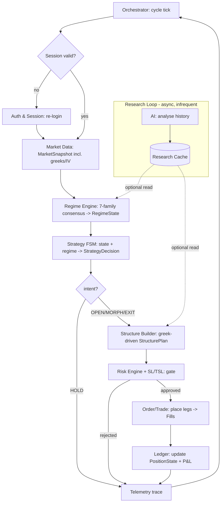

# ATOM — Technical Design (Buildable Modules)

**Companion to PROJECT_DOCUMENT.md (charter) and FUNCTIONAL_DESIGN.md (behaviour).**
Draft v0.4 · The *how*: buildable units, contracts, skeleton, traceability.

This document defines ATOM's **technical modules** — the buildable units a coding
agent owns and ships. Each module is independently buildable, testable, and talks to
the rest of the system only through frozen **contract objects** (§2).

Two layers, one catalog:
- **Platform modules** — cross-cutting infrastructure (Auth, Instrument, Market Data,
  Order/Trade, Ledger, Config, Telemetry, Orchestrator). Reusable, domain-light.
- **Strategy modules** — the trading brain (Regime, Strategy FSM, Structure Builder,
  Risk). The strategy lifecycle in FUNCTIONAL_DESIGN.md §1 *lives inside these*.

Still implementation-agnostic: no language, framework, or broker named here.

---

## 1. Pipeline Overview

One cycle, per index. Platform modules underneath; strategy modules in the flow.

```
                         ┌─────────── Config ───────────┐  (params to all)
                         │                              │
   Auth & Session ──► Market Data ──► Regime ──► Strategy FSM ──► Structure Builder
        │                                                              │
        │                            Instrument & Symbol Master  ◄─────┤ (strikes,
        │                                  (used by Builder + Order)    │  lots, fmt)
        ▼                                                              ▼
   broker conn ◄── Order / Trade ◄── Risk Engine ◄──────────────────────┘
                        │                 │ (SL/TSL/TP/DD gate)
                        ▼                 │
                     Ledger ◄─────────────┘
                        │
                        └──────► Telemetry / Audit ◄── (events from every module)

   Orchestrator / Scheduler drives the cycle, entry windows, EOD square-off.
```

Strategy modules produce a plan; **Risk Engine is the last gate** before Order/Trade
sends anything. Every module emits trace events to Telemetry.

---

## 2. Contract Objects (frozen in Phase 0)

The only things modules exchange. Functional field lists; pinned to schemas in Phase 0.

| Object            | Produced by        | Key fields (functional)                                                            |
|-------------------|--------------------|------------------------------------------------------------------------------------|
| `Session`         | Auth & Session     | broker token, login state, expiry, reconnect status                                |
| `Instrument`      | Instrument Master  | tradingsymbol, index, expiry, strike, right CE/PE, lot size, tick size             |
| `MarketSnapshot`  | Market Data        | index, timestamp, spot, option chain (strikes, CE/PE LTP, IV), multi-TF OHLC       |
| `RegimeState`     | Regime Engine      | index, regime ∈ {TREND_UP, TREND_DOWN, SIDEWAYS, REVERSAL}, confidence             |
| `StrategyDecision`| Strategy FSM       | intent ∈ {OPEN, MORPH_ADD, MORPH_CLOSE_LEG, HOLD, EXIT}, target structure, rationale|
| `StructurePlan`   | Structure Builder  | legs (`Instrument` + action BUY/SELL + qty), net credit, max loss                  |
| `RiskVerdict`     | Risk Engine        | approved bool, adjusted qty, breached rules, SL/TSL/TP levels                       |
| `OrderRequest`    | Order/Trade        | per-leg broker-agnostic order (`Instrument`, side, qty, type)                       |
| `Fill`            | Order/Trade        | order id, leg, fill price, qty, status, timestamp                                  |
| `PositionState`   | Ledger             | FSM state, open legs, entry prices, live P&L, realized P&L                          |
| `TraceEvent`      | every module       | source, type, payload, timestamp                                                   |

---

## 3. Platform Modules

### 3.1 Config
- **Does:** Single source for all params — strategy thresholds, strike rules, risk
  limits (deploy ₹2L, 10% DD floor, SL/TSL, re-entries), entry windows, broker creds
  reference. Feeds every module. No logic.

### 3.2 Telemetry / Audit
- **Does:** Collects `TraceEvent`s from every module into a decision/audit trail.
  Console + structured event log. Lets the system explain every transition and order.
- **In:** `TraceEvent`. **Out:** logs/traces.

### 3.3 Auth & Session
- **Does:** Broker login and **session lifecycle** — obtain token, keep-alive,
  detect expiry, reconnect. Gates the whole system: no `Session`, no trading. Hides
  broker-specific auth behind one interface.
- **In:** creds (from Config). **Out:** `Session`.
- **Why a module:** every live call (Market Data, Order/Trade) needs a valid session;
  centralising it avoids scattered re-login logic.

### 3.4 Instrument & Symbol Master
- **Does:** Authoritative contract metadata. Resolves the weekly expiry, builds the
  strike ladder, returns lot size and tick size, and **formats the broker
  tradingsymbol** (note: NIFTY vs SENSEX use different symbol formats — e.g.
  `SENSEX50[YY][MMM][DD][STRIKE][CE/PE]`). Resolves ATM/OTM strikes by offset or delta.
- **In:** index, spot, expiry rule. **Out:** `Instrument` objects.
- **Why a module:** symbol-format and lot/strike bugs are a known failure class; one
  module owns it so Structure Builder and Order/Trade never hand-format symbols.

### 3.5 Market Data
- **Does:** Supplies a `MarketSnapshot` per cycle — spot, weekly option chain (CE/PE
  prices, IV), multi-TF OHLC for regime detection. Source-agnostic (live, replay, or
  existing infra) behind one interface.
- **In:** index, `Session`, tick. **Out:** `MarketSnapshot`.

### 3.6 Order / Trade
- **Does:** Broker-agnostic order interface — place / modify / cancel, return `Fill`s.
  Idempotent; handles partial fills and rejects. Converts `StructurePlan` legs (already
  approved by Risk) into `OrderRequest`s and executes.
- **In:** `StructurePlan` + `RiskVerdict` + `Session`. **Out:** `Fill[]`.

### 3.7 Ledger / Persistence
- **Does:** Single source of truth for position state and P&L. Applies `Fill`s,
  maintains FSM `PositionState`, computes live and realized P&L. "What do we hold now"
  reads here.
- **In:** `Fill[]`. **Out:** `PositionState`.

### 3.8 Orchestrator / Scheduler
- **Does:** Drives the per-index cycle loop. Owns session lifecycle calls, entry
  windows, cycle cadence, and **mandatory EOD square-off**. Sequences modules in
  pipeline order.
- **In:** clock, Config. **Out:** cycle invocations.

---

## 4. Strategy Modules

> The functional lifecycle in PROJECT_DOCUMENT.md §4 is implemented here.

### 4.1 Regime Engine
- **Does:** Reads `MarketSnapshot`, classifies regime — TREND_UP / TREND_DOWN /
  SIDEWAYS / REVERSAL — with confidence. Trigger source for the Strategy FSM.
- **In:** `MarketSnapshot`. **Out:** `RegimeState`.
- **Open:** indicator set + timeframes that define each regime.

### 4.2 Strategy FSM (Adaptive Theta Engine) — *core of ATOM*
- **Does:** Holds the live state machine (FLAT → SINGLE_SPREAD → IRON_FLY → RUNNER →
  FLAT). Combines `RegimeState` + `PositionState`, emits a `StrategyDecision` (open
  with-trend spread, add opposing spread to morph into iron fly, close the threatened
  leg into a runner, hold, or exit).
- **In:** `RegimeState`, `PositionState`. **Out:** `StrategyDecision`.

### 4.3 Structure Builder / Strike Selector
- **Does:** Turns an abstract `StrategyDecision` into a concrete `StructurePlan` —
  asks Instrument Master for strikes/wings on the weekly expiry, builds the leg list,
  computes net credit and max loss.
- **In:** `StrategyDecision`, `MarketSnapshot`, Instrument Master. **Out:** `StructurePlan`.
- **Open:** strike rule (delta-band vs. fixed-distance vs. premium-target).

### 4.4 Risk Engine — *hard, deterministic gate*
- **Does:** Last gate before any order. Checks `StructurePlan` against deploy size
  (₹2L), 10% DD floor, daily-loss cap, sizing, re-entry count; approves / resizes /
  rejects. Contains the **SL/TSL/TP sub-engine** that, every cycle, monitors open
  positions and forces EXIT decisions on breach.
  - **SL/TSL sub-engine:** sets and trails stops per structure (incl. RUNNER); owns
    activation thresholds and trail step. Never overridable by any advisory/LLM layer.
- **In:** `StructurePlan`, `PositionState`. **Out:** `RiskVerdict`.

### 4.5 Research Loop Consumer *(seam, Phase 5)*
- **Does:** A read-only seam where the **separate AI research loop** (§8) drops cached
  insights/params (e.g. tuned family weights, suggested greek bands). The deterministic
  trading loop *optionally* reads them; everything still passes the risk gate.
- **Rule:** AI never sits inside the trade decision/risk path — it only writes cache the
  modules may read. See §8 for the two-loop architecture.

---

## 5. Phase 0 Skeleton — Build Order

Phase 0 = every module a **stub**: accepts its input contract, emits a print/trace,
returns a canned/passthrough output contract. Goal: full pipeline runs end-to-end,
seams frozen.

Build order follows the dependency chain:

1. **Config** — params object every module reads.
2. **Contract objects** (§2) — define all interfaces first.
3. **Telemetry** — so every later stub can emit traces.
4. **Auth & Session** stub — returns a canned `Session`.
5. **Instrument & Symbol Master** stub — returns canned `Instrument`s (real symbol fmt).
6. **Market Data** stub — emits a canned `MarketSnapshot`.
7. **Regime Engine** stub — returns a fixed `RegimeState`.
8. **Strategy FSM** stub — returns a fixed `StrategyDecision`; FSM scaffold present.
9. **Structure Builder** stub — returns a canned `StructurePlan`.
10. **Risk Engine** stub — approves with canned `RiskVerdict` (SL/TSL sub-engine stubbed).
11. **Order/Trade** stub — returns canned `Fill`s.
12. **Ledger** stub — accumulates `Fill`s into a `PositionState`.
13. **Orchestrator** — wires 1–12 into one logged cycle loop.

**Exit criterion:** orchestrator prints one full pass —
`Session → Instrument → MarketSnapshot → RegimeState → StrategyDecision →
StructurePlan → RiskVerdict → Fill → PositionState` — with a trace from each module,
and the contracts are frozen.

---

## 6. Module → Contract Matrix

| Module                     | Layer    | Consumes                              | Produces           |
|----------------------------|----------|---------------------------------------|--------------------|
| Config                     | Platform | —                                     | params             |
| Telemetry / Audit          | Platform | `TraceEvent` (all)                    | logs               |
| Auth & Session             | Platform | creds                                 | `Session`          |
| Instrument & Symbol Master | Platform | index, spot, expiry rule              | `Instrument`       |
| Market Data                | Platform | index, `Session`                      | `MarketSnapshot`   |
| Order / Trade              | Platform | `StructurePlan`,`RiskVerdict`,`Session`| `Fill[]`          |
| Ledger / Persistence       | Platform | `Fill[]`                              | `PositionState`    |
| Orchestrator / Scheduler   | Platform | clock, Config                         | cycle invocations  |
| Regime Engine              | Strategy | `MarketSnapshot`                      | `RegimeState`      |
| Strategy FSM               | Strategy | `RegimeState`, `PositionState`        | `StrategyDecision` |
| Structure Builder          | Strategy | `StrategyDecision`,`MarketSnapshot`,Instrument | `StructurePlan` |
| Risk Engine (+SL/TSL)      | Strategy | `StructurePlan`, `PositionState`      | `RiskVerdict`      |

---

## 7. Requirements Traceability Matrix (RTM)

Bridges all three docs: every **requirement** (PROJECT_DOCUMENT.md §9) →
**functional module** (FUNCTIONAL_DESIGN.md §3) → **technical module(s)** (§3–§4 here).
So every line of code and test traces to a need, and every requirement is provably
covered both ways.

| Req   | Functional module       | Technical module(s)                          |
|-------|-------------------------|----------------------------------------------|
| FR-1  | FM-Regime               | Regime Engine                                |
| FR-2  | FM-Lifecycle            | Strategy FSM → Structure Builder → Order/Trade|
| FR-3  | FM-Lifecycle            | Strategy FSM → Structure Builder → Order/Trade|
| FR-4  | FM-Lifecycle            | Strategy FSM → Structure Builder → Order/Trade|
| FR-5  | FM-StructureSelection   | Structure Builder + Instrument & Symbol Master|
| FR-6  | FM-Lifecycle            | Strategy FSM + Ledger                         |
| RR-1  | FM-RiskControl          | Risk Engine                                  |
| RR-2  | FM-RiskControl          | Risk Engine + Ledger                         |
| RR-3  | FM-StopManagement       | Risk Engine → SL/TSL sub-engine              |
| RR-4  | FM-RiskControl          | Risk Engine + Ledger                         |
| RR-5  | FM-SessionLifecycle     | Orchestrator + Risk Engine + Order/Trade     |
| RR-6  | FM-RiskControl          | Risk Engine (gate; research loop read-only)  |
| PR-1  | FM-Connectivity         | Auth & Session                               |
| PR-2  | FM-InstrumentResolution | Instrument & Symbol Master                   |
| PR-3  | FM-MarketData           | Market Data                                  |
| PR-4  | FM-Execution            | Order / Trade                                |
| PR-5  | FM-Bookkeeping          | Ledger / Persistence                         |
| PR-6  | FM-Audit                | Telemetry / Audit                            |
| PR-7  | FM-Configuration        | Config                                       |
| PR-8  | FM-SessionLifecycle     | Orchestrator / Scheduler                     |

Coverage check: every FR/RR/PR maps to ≥1 technical module; every technical module
serves ≥1 requirement. NFR-1..3 are design constraints honored across all modules
(contracts in §2, skeleton in §5).

---

## 8. Two-Loop Architecture — Trading Loop vs. Research Loop

A hard separation: **AI stays out of the trading loop.** ATOM runs two loops at
different cadences.

```
   FAST — TRADING LOOP (deterministic, every cycle)
   ┌──────────────────────────────────────────────────────────────────┐
   │ Market Data → Regime → Strategy FSM → Structure Builder → Risk →  │
   │ Order/Trade → Ledger → Telemetry                                  │
   │ No LLM in this path. Reads params + (optional) cached research.   │
   └───────────────▲───────────────────────────────┬──────────────────┘
                   │ reads cache                     │ writes trades/telemetry
                   │ (params, weights)               ▼
   ┌───────────────┴──────────────────────────────────────────────────┐
   │ SLOW — RESEARCH LOOP (AI, infrequent: e.g. EOD / periodic)        │
   │ inputs: trade history, regime stats, indicator efficacy, P&L      │
   │ outputs: RESEARCH CACHE — suggested family weights, greek bands,  │
   │          pattern findings. Advisory only; risk gate still applies.│
   └──────────────────────────────────────────────────────────────────┘
```

Properties:
- **Determinism in the hot path** — the trading loop is fully testable/replayable; no
  LLM latency, non-determinism, or hallucination can touch a live order.
- **Research is read-only and async** — it writes a cache the fast loop *may* read; it
  never calls the broker and never relaxes risk.
- **Cadence** — research runs far less often than the trading cycle (e.g. between
  sessions). Mirrors the house position-research-cache pattern.

`ResearchCache` is a contract object: { family weight suggestions, greek-band
suggestions, pattern notes, generated-at, validity window }.

---

## 9. AI-Utilization Research (per area)

Where AI/LLM adds value — and where it must not. Filled in detail during grilling.

| Area                         | AI used? | How / why                                                        |
|------------------------------|----------|------------------------------------------------------------------|
| Trading loop (regime→order)  | **No**   | Deterministic; AI excluded from hot path (§8).                   |
| Research loop                | Yes      | Tune family weights, surface greek-band candidates, find patterns in trade history. Output cached, advisory. |
| Strategy ideation / grilling | Yes      | Pre-build: pressure-test rules, propose threshold candidates (human-gated). |
| Build (OUROBOROS)            | Yes      | Builder/test/review agents implement against contracts (§10).    |
| Post-trade explainability    | Yes      | Summarise decision traces for the operator; never alters trades. |

Open research questions: model choice and cost per loop; how research suggestions are
validated before the fast loop is allowed to consume them; guardrails so a bad
suggestion cannot degrade live trading.

---

## 10. Build Feedback Loop — OUROBOROS

ATOM is built by a multi-agent loop, not hand-coded in one pass.

```
   ┌─► BUILD ───► TEST ───► REVIEW ───► GATE ───► (promote) ─┐
   │   builder    run       validator   human            │
   │   agent      suite      agent       approval         │
   └──────────────◄──── iterate on failure ───────────────┘
```

- **Build** — agent implements one module/ticket against the frozen contracts (§2).
- **Test** — full suite runs (unit + integration + sim harness, §11). Red → back to build.
- **Review** — validator agent checks correctness, contract conformance, no fake P&L /
  hallucinated data; raises findings (does not silently fix).
- **Gate** — human approves promotion; agents own build, humans own gates.
- **Loop** — on pass, advance to the next ticket in the dependency order (§5, and
  PROJECT_DOCUMENT.md §6 phase graph).

This is the *build-time* feedback loop; the *runtime* learning loop is the research loop
(§8). They are distinct.

---

## 11. Test Strategy

Every module ships with tests; nothing promotes on green-count alone.

- **Unit** — per module, against its input/output contract; pure logic (regime votes,
  greek-band math, FSM transitions, SL/TSL triggers).
- **Integration** — pipeline slices (e.g. Regime→FSM→Builder→Risk) on canned snapshots.
- **Sim / Replay Harness** — deterministic end-to-end runs over recorded or synthetic
  market data (mock-websocket style), driving the full lifecycle incl. fault injection
  (e.g. missing greeks, bad tick, reversal mid-fly). Mirrors the house PORCUPINE harness.
- **Contract conformance** — assert every module honours §2 shapes; catch silent
  drops/format bugs.
- **Risk invariants** — property tests: no path exceeds deploy/DD, none skips EOD
  square-off, research/AI can never relax the gate.

Each requirement (RTM §7) must have ≥1 test tracing to it before its module promotes.

---

## 12. Implementation Flow (one trading cycle)


